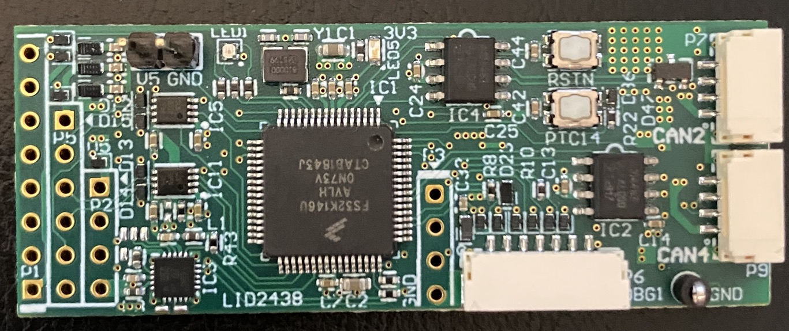
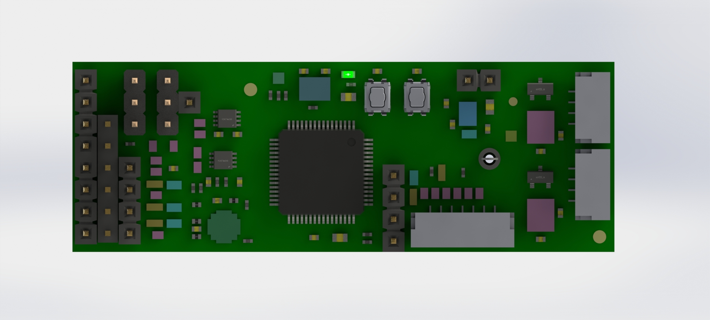
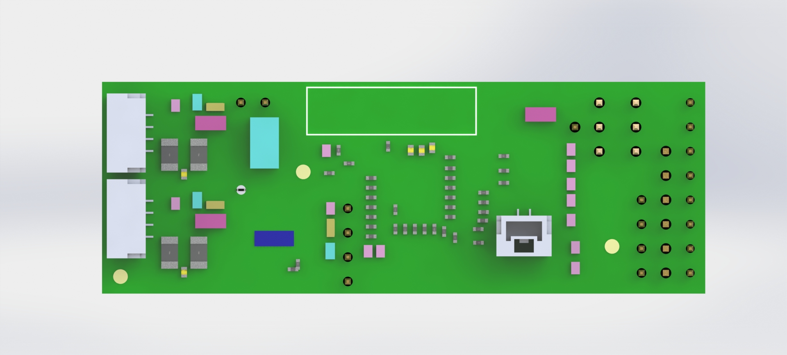
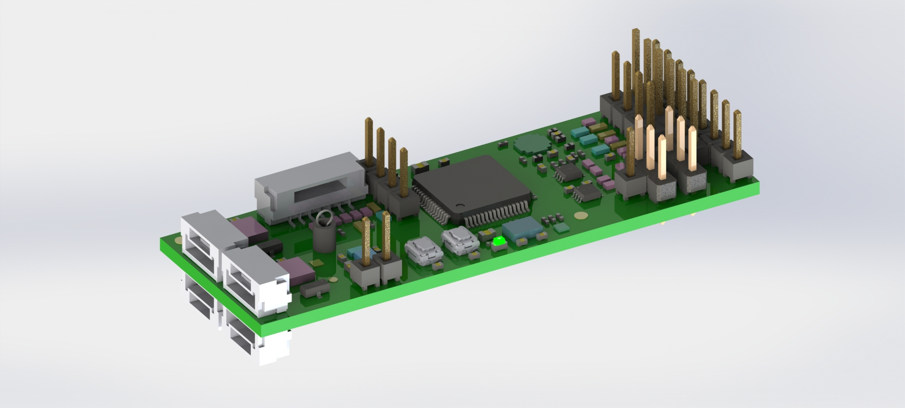

# UCANS32K146

## NOTE: DRAFT DRAFT This Gitbook is a work in progress.

## What is the UCANS32K146?

The UCANS32K146 is a board designed to act as a bridge between GPIO, I2C, SPI, UART, and UAVCAN. Sensors and peripherals can be connected to the board and controlled by the RDDRONE-FMUK66 over the CAN bus. Some specific use cases are:

1. Output PWM for motors or servos
   * Relieves the FMU of creating RC-PWM signals
   * Can report information about the motors back to the FMU
2. BMS
   * Report power consumption, state of charge, battery health and other faults to the FMU
3. GPS
   * Allows for more than one GPS to be connected to the FMU by communicating GPS info over CAN
4. Sensors
   * Airspeed/pressure sensors can report information to the FMU over CAN
5. Anything else
   * Remote lights, arming switches, and safety switches are other peripherals that can be connected to the board and controlled/communicated to the FMU

## How to navigate this Gitbook

This Gitbook should read in order based on the sections on the left. 

