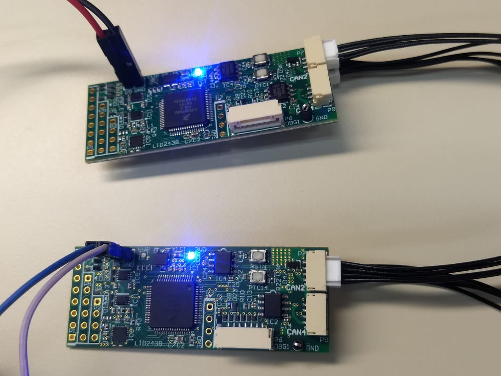
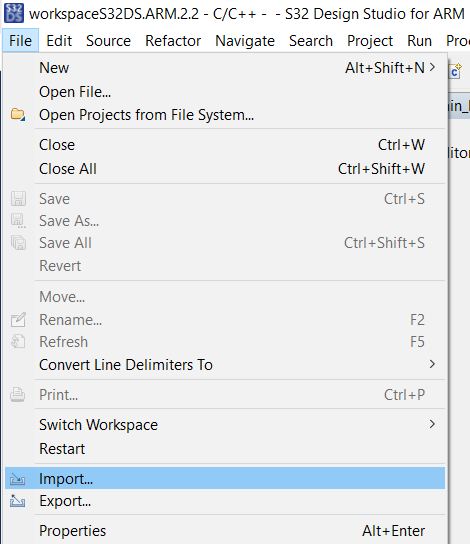
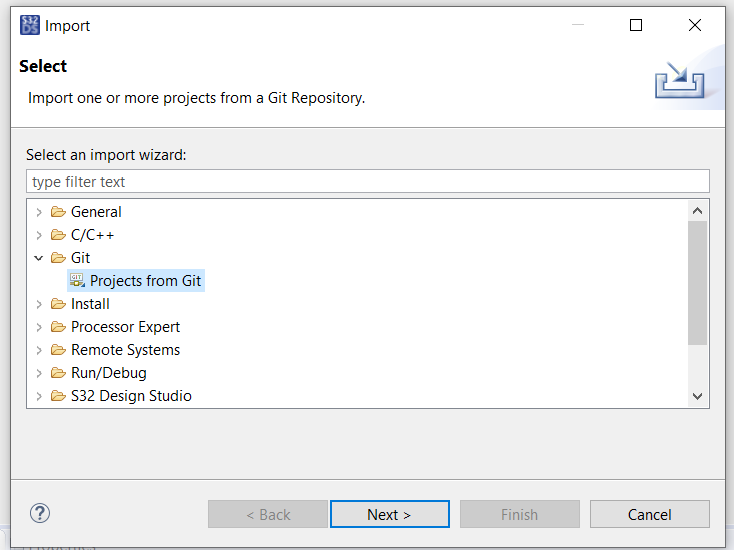
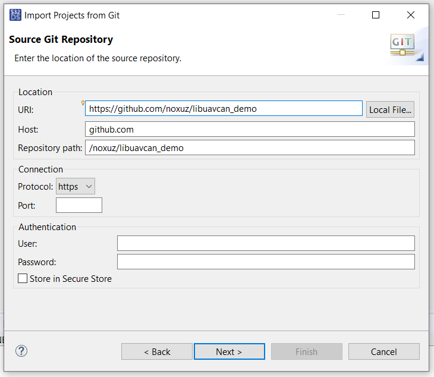
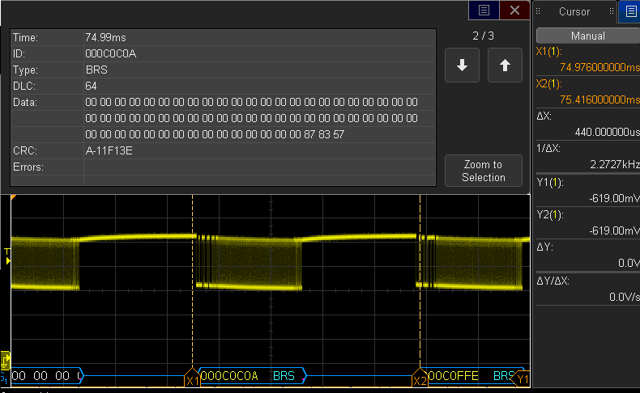

# Quick Start Demo

Download and install S32 Design Studio at [**nxp.com/S32DS**](www.nxp.com/s32ds)\*\*\*\*

Interconnect 2 UCANS32K146 boards with a single CAN JST-GH cable between both CAN2 sockets, and a CAN termination in the connector below.

Connect a 5V supply to the pin headers.

In S32DS, click File -&gt; Import

Select "Projects from Git" and click next

 Paste the Git URL of the demo and click next. [https://github.com/noxuz/libuavcan\_demo](https://github.com/noxuz/libuavcan_demo)

Click the master branch and next.

Click "Browse" for the desired destination directory of the project and click next

Choose "Import existing Eclipse projects" and click next and then "Finish".

Click the down arrow at the right of the Hammer Icon in the toolbar and select a desired build for NODE\_A or NODE\_B.

Click the yellow ligthning shaped icon in the toolbar for flashing the project into the board.

In the list loacted at the left of the popped windowd and choose the same of profile previosuly built "libuavcanV1\_demo\_Debug NODE\_A" for example and click flash with the board connected to the Jlink debugger and to 5V power.

Repeat steps 9-11 for the other board but with the desired build configuration NODE\_A or NODE\_B swapped

A green led close to the 5V headers should blink approx each second, read description in top of src/main.cpp, if the green LED from both boards is still, try pressing the reset button in the board that got the NODE\_A program flashed into, which is the one that starts the transmission.

With an oscilloscope view the frames being transmited at 4Mbit/s data phase and 1Mbit/s in nominal phase.

